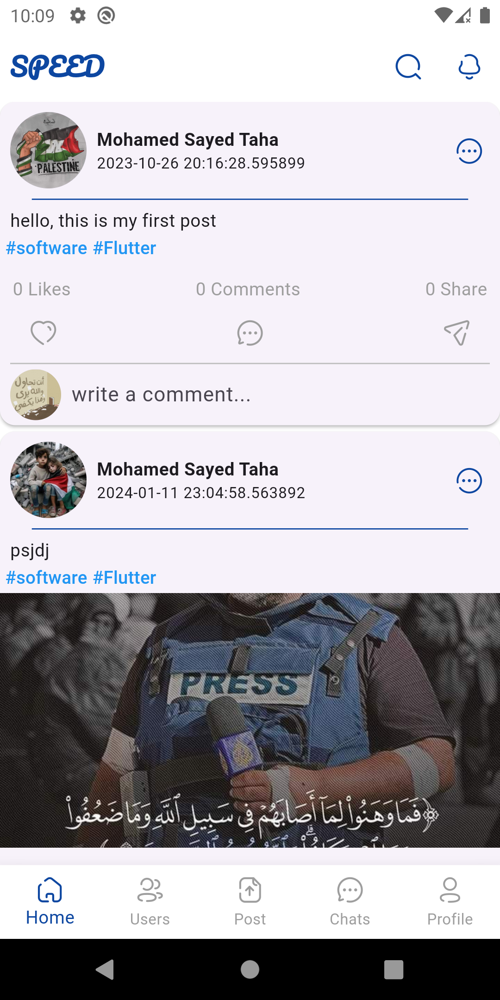
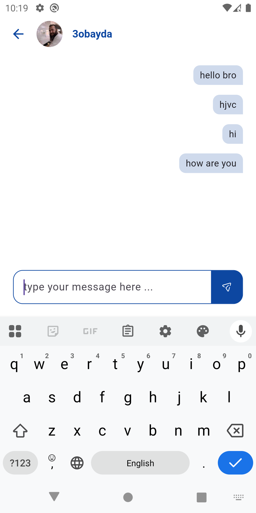

# 🚀 Speed

Speed is a **Flutter-based mobile application** designed as a social platform to connect users, share updates, and build community.  
It features modern UI/UX design and a modular architecture for scalability.

---

## 📱 Overview

Speed allows users to:
- Create and manage their user profile.
- Share posts, images, and updates with friends or followers.
- Browse the feed and interact with other users.
- Enjoy a smooth navigation experience with intuitive screens.

The app is built with Flutter and uses a modular folder structure for clear separation of functionality.

---

## 🚀 Features

- ✅ **User Authentication:** Secure login/signup (e.g., via Firebase).  
- 📸 **Feed & Posts:** Upload posts/images and view posts from others.  
- 👥 **Social Features:** Follow/unfollow users, like and comment on posts.  
- 🧱 **Modular Architecture:** Core + Feature directories for clean code.  
- 📊 **Responsive Design:** Works on various screen sizes and platforms.  

---

## 🧩 Tech Stack

- **Framework:** Flutter  
- **Language:** Dart  
- **Backend Services:** *Firebase*  
- **Architecture Pattern:** Modular (Core / Feature‑based structure)  
- **State Management:** *Cubit*  

---

# 📸 Screenshots

| Login Screen | Register Screen |
|-------------|--------------|
|  |  | 

| Home Screen | New Post | Profile Screen |
|-------------|--------------|--------------|
|  |  |  | 

| Chats Screen | Chat Details |
|-------------|--------------|
|  |  | 

---

## 🛠 Dependencies
```
  bloc: ^9.0.0
  flutter_bloc: ^9.1.1
  fluttertoast: ^8.2.2
  shared_preferences: ^2.2.2
  smooth_page_indicator: ^1.1.0
  conditional_builder_null_safety: ^0.0.6
  google_fonts: ^6.1.0
  image_picker: ^1.0.4

  # firebase
  firebase_core: ^4.1.0
  firebase_auth: ^6.0.2
  firebase_storage: ^13.0.1
  firebase_messaging: ^16.0.1
```
---

## ⚙️ Installation

1. Clone this repository:
   ```bash
   git clone https://github.com/mo7amedsayed74/CalorieCare.git
   
2. Navigate to the project folder:
   ```bash
   cd CalorieCare

4. Install dependencies:
   ```bash
   flutter pub get

6. Run the app:
   ```bash
   flutter run

## 🧑‍💻 Author

  **Mohamed Sayed** 
  
  Flutter Developer
  
  <div align="start">
      <a href="https://www.linkedin.com/in/mohamed-sayed74/" target="_blank">
          
      </a>
    <a href="mailto:mohammedsayed7414@gmail.com">
      
    </a>
      <a href="https://www.youtube.com/@mohamedsayed_8360">
      
    </a>
       <a href="https://t.me/Mo7amedSayed14">
      
    </a>
  </div>
